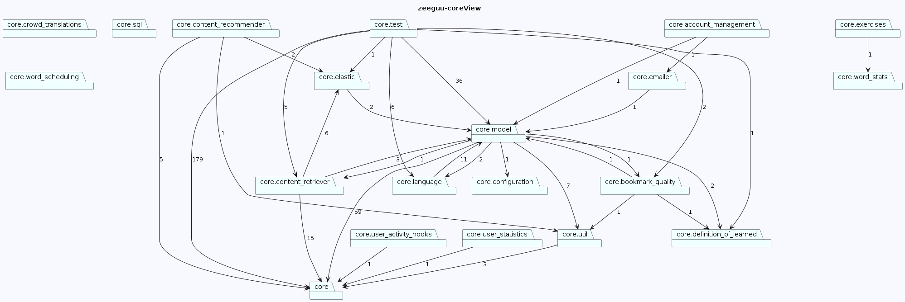

# MT-Diagrams (Temporary name)

MT-diagrams is a software tool designed for Python systems that enables you to create <b> customized/filtered </b> visual package views. These views display the various packages included in your system and their dependencies. With MT-diagrams, you have the flexibility to include or exclude specific packages based on your requirements.

For illustration purposes, we'll use the [Zeeguu](https://github.com/zeeguu/api) GitHub project as an example. 

In addition, the system can identify and highlight the differences between your working branch and a specified remote branch, including added or removed dependencies, as well as created or deleted packages through green and red highlighting.

Lastly, the system is capable of showing the highlighted diffrences in the system views when a pull request is created on github. The system will automatically create the views specified in your config, highlight the differences and display them in your pull request, making it easy for a reviewer to spot mistakes.

Throughout this readme, different options will be displayed in combination with the setup of a config file to help you get started.

## Installation

To install mt-diagrams, simply use the pip package manager by running the following command:

`pip install mt-diagrams` (You might need administrative right to perform the operation)

This will download and install the necessary files and dependencies needed for mt-diagrams to run properly.

## Commands

All commands must be run from the project's root folder

<b>The system has 4 commands:</b> 


-`mt-diagrams create-config`- Creates the config template

-`mt-diagrams render` - Renders the views specified in the config

-`mt-diagrams render-diff` - Renders the differences in the views between your working branch and a specified branch

-`mt-diagrams create-action` Creates the github action which will automatically add the diffrence views to pull requests.

# Using the system

This section will be taking you through using the system and its command, explaining the outputs and rendering views of a API project called  'zeeguu-api' which you can find here: https://github.com/zeeguu/api

The project is not large, but as you will see, grasping an understanding of the system even for this project size of roughly 40 packages is a challenge.

Heres a render of the entire system:


The project contains 2 major parts, "api", and "core". Now heres a view of the system where everything except "core" and its sub modules has been scraped away.


In order to create the views you must be in the root of your project and run the setup-command:

- `mt-diagrams create-config` 

This will create a file in your root folder called "mt-config.json", which is where you can edit your different desired views.

```json
 {
    "$schema": "https://raw.githubusercontent.com/Perlten/MT-diagrams/master/config.schema.json",
    "name": "",
    "rootFolder": "",
    "github": {
        "url": "",
        "branch": "main"
    },
    "saveLocation": "./diagrams/",
    "views": {
        "completeView": {
            "packages": [],
            "ignorePackages": []
        }
    }
}

```

Next is an edited version of the above the mt-config.json file, representing how the first 2 views were created including comments shortly explaining each field:

```json
{
    "$schema": "https://raw.githubusercontent.com/Perlten/MT-diagrams/master/config.schema.json",
    "name": "zeeguu", # Name of project
    "rootFolder": "zeeguu", # Name of source folder
    "github": {
        "url": "https://github.com/zeeguu/api", # Link to project's Github
        "branch": "master" # Name of main/master branch of project
    },
    "saveLocation": "./diagrams/", # Location to store generated diagrams
    "views": { # Define each view
        "completeView": { # Name of first view, you may add more
            "packages": [], # Select packages to see in view, if left empty, see entire system view
            "ignorePackages": [] # Specify packages not to include in diagram
        }, "coreView":{ # Create view containing specific packages
            "packages": [
                "core", # In this case, we only allow packages starting with the name 'core'
            ],
            "ignorePackages": []
        }
    }
}

```

### Upon creating your mt-config file, you are ready to render the views by the next command
- `mt-diagrams render`

This will render the views specified in your mt-config.json

## Further Filtering of packages

The core view, we may still find a little too large to grasp, so we create a new view, but this time, instead of giving a path to the package "core", we limit it further saying we want to see "core" and only its sub modules 1 layer down:



This was done through this mt-config.json file:

```json
{
    "$schema": "https://raw.githubusercontent.com/Perlten/MT-diagrams/master/config.schema.json",
    "name": "zeeguu", 
    "rootFolder": "zeeguu", 
    "github": {
        "url": "https://github.com/zeeguu/api", 
        "branch": "master" 
    },
    "saveLocation": "./diagrams/", 
    "views": { 
         "coreView":{ 
            "packages": [
                #We create an object instead of a path
                 {
                    "depth": 1, #We only want 1 layer of sub modules from core
                    "packagePath": "core" #Just like before, we give the path
                } 
            ],
            "ignorePackages": []
        }
    }
}

```

- Note: You can add a combination of packages using both strings and objects, for example:
```json
packages: [
    "api/utils",
    {
    "packagePath": "core",
    "depth": 1
    }
 ]
```
This would allow any package starting from "api/utils" combined with "core" and depth of 1.

## Arrows
Each arrow represents a dependency between two modules, and the number seen on the arrow is the amount of dependencies going in the arrows direction. If you do not wish to see these arrows, there is an optional setting you can add "showDependencyCount" which is a boolean

```json
{
    "$schema": "https://raw.githubusercontent.com/Perlten/MT-diagrams/master/config.schema.json",
    "name": "zeeguu", # Name of project
    "rootFolder": "zeeguu", # Name of source folder
    "github": {
        "url": "https://github.com/zeeguu/api", # Link to project's Github
        "branch": "master" # Name of main/master branch of project
    },
    "showDependencyCount": false, <------ here we remove the arrows.
    "saveLocation": "./diagrams/", # Location to store generated diagrams
}
```
In this mt-config file, the dependency count would be gone. This setting is applied to all of the views.   

## Ignore packages
In addition to selecting which packages you want in your diagram, you can also select which packages you want removed from your diagram.

This can be done in two different ways:

```json
packages: [
"*test*" #Removes any package which contains test
"api/test" #Removes the package api/test and all of its sub modules
]
```

### Heres an example:

```json
{
    "$schema": "https://raw.githubusercontent.com/Perlten/MT-diagrams/master/config.schema.json",
    "name": "zeeguu", 
    "rootFolder": "zeeguu", 
    "github": {
        "url": "https://github.com/zeeguu/api", 
        "branch": "master" 
    },
    "saveLocation": "./diagrams/", 
    "views": { 
         "coreView":{ 
            "packages": [
                #We create an object instead of a path
                 {
                    "depth": 1, 
                    "packagePath": "core/language" #We now take one step further down in allowed packages 
                } 
            ],
            "ignorePackages": []
        }
    }
}

```


## The diffrence views
In order to get a difference view, you must be on another branch to the one you've specified in the config. Typically you would compare your current branch to main/master, but you can choose any branch you want. For the sake of this next view, I have filtered the core view a little more